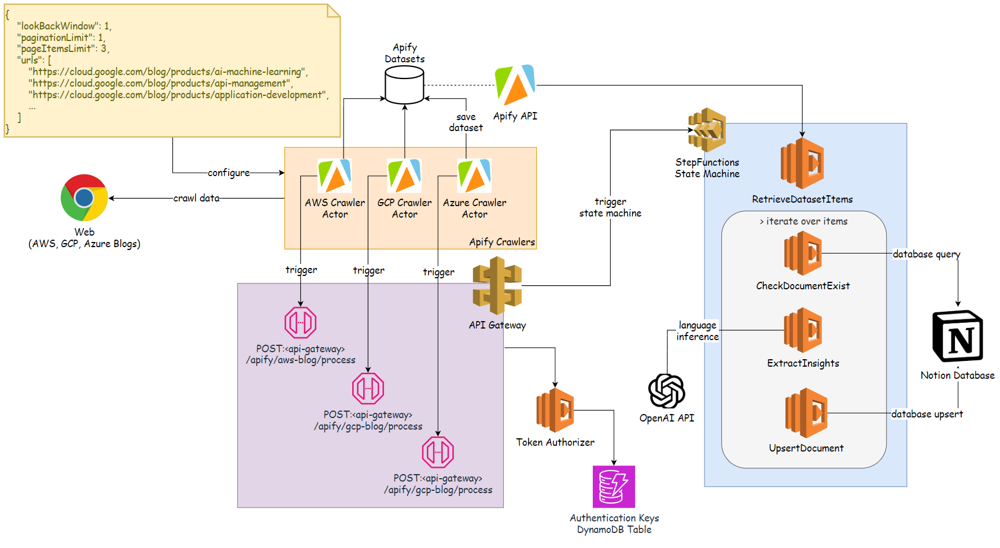
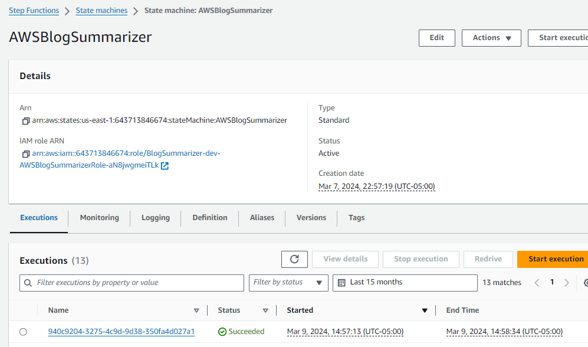

# Blog Summarizer

Serverless application built with AWS Step Functions to summarize blog posts scraped by Apify.

# Systems Design



# Development

Serverless framework is a fundamental requirement to operate with the code base. So install it with corresponding plugins:
```sh
npm install -g serverless@3
sls plugin install -n serverless-step-functions
sls plugin install -n serverless-python-requirements
sls plugin install -n serverless-dotenv-plugin
sls -version
```

A few python libraries are required to run, debug and test code:
```sh
pip install awscli
pip show aws
pip install -U pytest
pip install pipreqs
```

You can use `.env` for local development by storing secrets and keys there:
```sh
cp .env.example .env
cat .env
vi .env # change your secrets
```

Later, you also want to test that your code works with Cloud Secrets. First create the secrets themselves:
```sh
aws secretsmanager create-secret --name BlogSummarizer-NotionToken --secret-string $(cat .env | grep NOTION_TOKEN | cut -d'=' -f2)
aws secretsmanager create-secret --name BlogSummarizer-ApifyToken --secret-string $(cat .env | grep APIFY_TOKEN | cut -d'=' -f2)
aws secretsmanager create-secret --name BlogSummarizer-OpenAIKey --secret-string $(cat .env | grep OPENAI_API_KEY | cut -d'=' -f2)
# retrieve and check the secrets
# aws secretsmanager get-secret-value --secret-id BlogSummarizer-NotionToken | jq -r .SecretString
```

Change the secret definition with a `sm:` prefix for code to retrieve them from AWS Secrets Manager:
```sh
OPENAI_API_KEY=sm:BlogSummarizer-OpenAIKey
```

Provide permissions to the lambda to access the secrets:
```sh
# serverless.yaml
provider:
  name: aws
  runtime: python3.11
  iam:
    role:
      statements:
        - Effect: "Allow"
          Resource:
            - "arn:aws:secretsmanager:us-east-1:643713846674:secret:BlogSummarizer-ApifyToken-mJdUQy"
            - "arn:aws:secretsmanager:us-east-1:643713846674:secret:BlogSummarizer-OpenAIKey-3D0xCl"
            - "arn:aws:secretsmanager:us-east-1:643713846674:secret:BlogSummarizer-NotionToken-lbwg2t"
          Action: "secretsmanager:GetSecretValue"
```

To test Step Functions steps independently, define `launch.json` in the similar manner to allow debugging:
```sh
{
  "version": "0.2.0",
  "configurations": [
    {
      "name": "blog-summarizer",
      "type": "python",
      "request": "launch",
      "module": "blog_summarizer.handler._test",
      "envFile": ".../blog-summarizer/blog-summarizer/.env",
      "cwd": ".../blog-summarizer/blog-summarizer",
      "console": "integratedTerminal",
    },
```

That'll be runnig `blog_summarizer.handler._test` module in a debug mode to simplify development.

A good practice is to define proper tests in various `<name>_test.py` files and execute them holistically with `pytest`.

```sh
$ export $(grep -v '^#' /home/izlobin/ws/blog-summarizer/blog-summarizer/.env | xargs) # required to export variables from .env into shell session
$ pytest
============= test session starts =============
platform linux -- Python 3.11.7, pytest-8.0.2, pluggy-1.4.0
rootdir: /home/izlobin/ws/blog-summarizer/blog-summarizer
plugins: anyio-4.3.0
collected 1 item

blog_summarizer/handler/_test.py .                                                                                                                                                                                                 [100%]

============= 1 passed in 0.75s =============
```

# Deployment
Once everything is tested and works locally, you can proceed with deployment to cloud environment.

That comes down to automatically updating dependencies `requirements.txt` and executing `serverless deploy` command:
```sh
pipreqs --force blog_summarizer && mv -f blog_summarizer/requirements.txt requirements.txt
sls package
# sls remove -s dev
sls deploy -s dev
```

# Test
You can finally test the solution by sending an Apify payload to the endpoint provisioned. You can get the endpoint either in the console or through aws cli.
```sh
cd /home/izlobin/ws/blog-summarizer/blog-summarizer
TOKEN=$(grep -oP '(?<=AUTHORIZER_TOKEN=).*' .env)

curl -v -X POST \
  -d @".../blog-summarizer/blog_summarizer/handler/test_data/apify_payload.json" \
  -H "Authorization: Bearer $TOKEN" \
  https://<API_GATEWAY_ID>.execute-api.us-east-1.amazonaws.com/dev/apify/aws-blog/process

# {"executionArn":"arn:aws:states:us-east-1:643713846674:execution:AzureBlogSummarizer:a8a77ef6-8ccb-4e1a-b0de-3e69f8101875","startDate":1.710029283873E9}(tech)
```

You should see the execution report in the output and can go check AWS console for a more detailed view.


